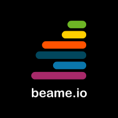
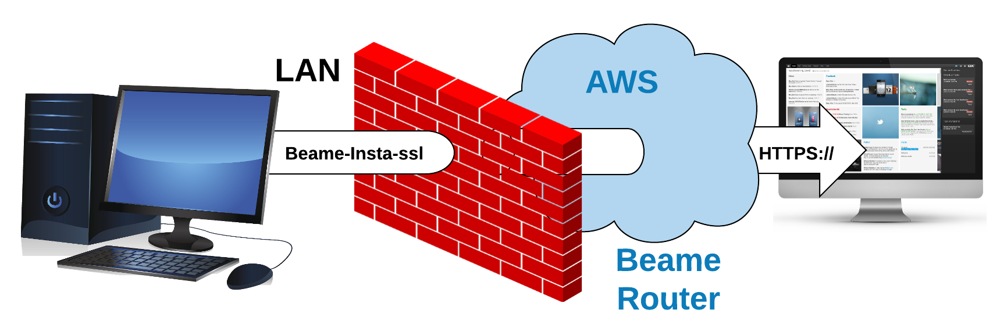
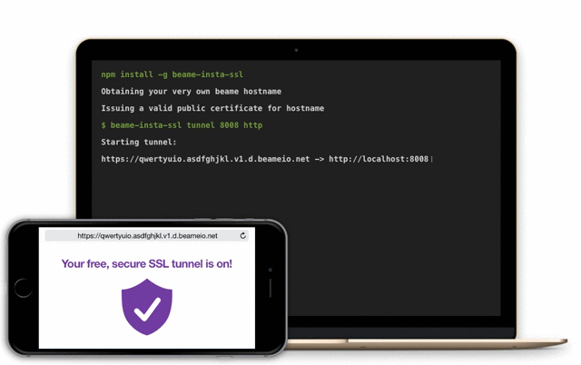
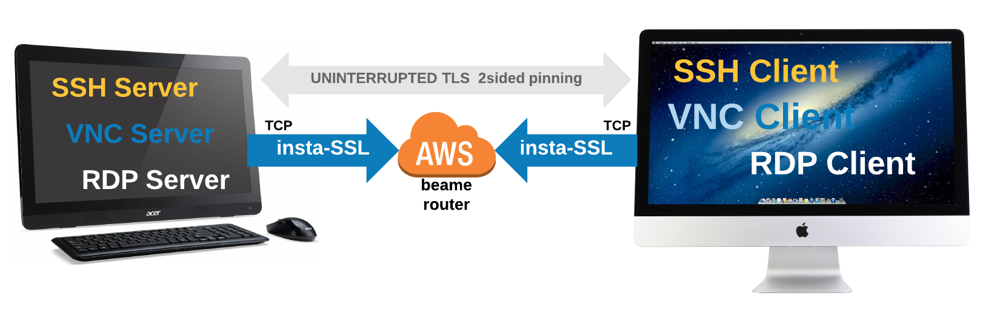

# beame-insta-ssl

## What is beame-insta-ssl?

This is a free, open-source tool that allows you to expose securely a machine with HTTP or HTTPS server via a random hostname without needing to have a public IP address.

When using Beame.io, the private key never leaves your computer/server. Beaqme cannot look into your traffic. While, theoretically, Beame.io could issue a wildcard `*.beameio.net` certificate and terminate your traffic (which we don't do), this is preventable by checking certificate fingerprints.

## Who is beame-insta-ssl for?

Any users of remote access (RDP, VNC, SSH etc), web developers, web designers, anyone whose work product is displayed in a browser.

## What is the most common and valuable use case?
 * I have to access my linux machine but company policy restricts exposing port 22 to the global network
 * I am developing for iOS, and I want to test my web application against my backend code, but it is much more convenient for me to test locally. Beame allows me to expose my local development server to the mobile device with TLS terminated at my local workstation.
 * I want to be able to access my home PC from my laptop, I run RDP on it, but I don't have public IP and I don't want to rely on Username/Password either

## Get started in three quick steps!

Step 1: Sign up super-fast [here!](https://ypxf72akb6onjvrq.ohkv8odznwh5jpwm.v1.p.beameio.net/insta-ssl)

(if you use Windows, see [Windows System Requirements](#windows-system-requirements) below before Step 2)

Step 2 for Mac/Linux: Run `sudo npm install -g beame-insta-ssl` (**please make sure you are using NodeJS version 6.9.X or newer**). Depending on your configuration you might want to run `npm install -g beame-insta-ssl` instead (if you are using [`n`](https://github.com/tj/n) or other methods for creating per-user NodejS installations).

Step 2 for Windows: Run `npm install -g beame-insta-ssl` (**please make sure you are using NodeJS version 6.9.X or newer**).

Step 3: Run the command in the sign up confirmation email you just got from us. beame-insta-ssl will obtain your very own beame hostname, and issue a valid public certificate for it.

The certificate will be ready in moments and you can start using your tunnel right away. Truly a one-stop-shop!

### Windows System Requirements

Before running `npm install -g beame-insta-ssl` please make sure you have OpenSSL installed in `C:\OpenSSL-Win64` . If you you already have OpenSSL installed at that location, skip the instructions below and just issue `npm install -g beame-insta-ssl`. If you don't have OpenSSL in `C:\OpenSSL-Win64`, one of the possible ways of installing OpenSSL is described below (Install Visual C++ Build Tools and Python 2.7, Upgrade NPM, Install Perl, Install OpenSSL). The procedure was tested on Microsoft Windows Server 2012 R2 Standard and Windows 10. We recommend to use your “Windows PowerShell” and run it with administrator rights for the following commands:

### Install Visual C++ Build Tools and Python 2.7

`npm install --global --production windows-build-tools`. This typically takes 5 to 10 minutes, depending on the internet connection.

### Upgrade NPM

`npm -g install npm@latest`

### Install Perl

Perl is needed for building OpenSSL. If you already have Perl installed, please skip the `Install Perl` section.

Get Perl from
`https://downloads.activestate.com/ActivePerl/releases/5.24.0.2400/ActivePerl-5.24.0.2400-MSWin32-x64-300558.exe` (SHA256 is `9e6ab2bb1335372cab06ef311cbaa18fe97c96f9dd3d5c8413bc864446489b92`)
or another source.
 This version of Perl [might have](https://community.activestate.com/node/19784) [security](https://www.virustotal.com/en/file/9e6ab2bb1335372cab06ef311cbaa18fe97c96f9dd3d5c8413bc864446489b92/analysis/) [issue](https://www.metadefender.com/#!/results/file/c869301df9424b02aa49ce15d7bce692/regular/analysis) but my estimation is that it's false positive. Consider installing other versions or Perl built by other companies.

### Install OpenSSL

Download and extract `https://www.openssl.org/source/openssl-1.0.1t.tar.gz` (other versions might work but were not tested)

Using "Visual C++ 2015 x64 Native Build Tools Command Prompt" under `C:\Program Files (x86)\Microsoft Visual C++ Build Tools\` in the OpenSSL directory issue the following commands:

    perl Configure VC-WIN64A no-asm --prefix=C:\OpenSSL-Win64
    .\ms\do_win64a.bat
	# If the following "clean" fails it's OK, just continue with following commands
    nmake -f ms\ntdll.mak clean
    nmake -f ms\ntdll.mak
    nmake -f ms\ntdll.mak install

    npm install -g beame-insta-ssl

**Check out our Wiki with how to guides:**

1. [Beginner's Guide to beame-insta-ssl with Screenshots](https://github.com/beameio/beame-insta-ssl/wiki/Beginner%E2%80%99s-Guide-to-Using-beame-insta-ssl)
2. [Installing a Non-Terminating Tunnel to IIS on Windows](https://github.com/beameio/beame-insta-ssl/wiki/How-to-Install-a-Non-Terminating-Tunnel-to-IIS)

## What is the difference between terminating and non-terminating?

Terminating tunnel will make the insta-ssl terminate TLS for you (_on the machine that runs it_), the output into your server will be HTTP (unencrypted). Non-terminating is better, if you install _your_ application on different computer, but in such case your task will be to inject the cert into your server.

## How much data can I transfer?

Right now we are not limiting it, but might if we get unreasonable usage.

## Can I lose my beame domain?

Yes. If you use it for phishing we will blacklist it and revoke corresponding cert (see license for details). Another way - if you loose your private key your domain is gone for sure.

## Commands for using beame-insta-ssl:

Step 1: [Sign up here, humans only,](https://ypxf72akb6onjvrq.ohkv8odznwh5jpwm.v1.p.beameio.net/insta-ssl) and receive your personal token by email (make sure you use an email you can access).

Step 2: Install beame-insta-ssl by running	`npm install -g beame-insta-ssl`

Step 3: Run the command in your registration confirmation email. beame-insta-ssl will obtain your very own beame hostname, and issue a valid public certificate for it.

The certificate will be ready in moments and you can start using your tunnel right away.

Sample command for bringing up a tunnel:

	beame-insta-ssl tunnel make --dst 8008 --proto http

Use the command above if you want to have a secure connection, but don't want to install certificates into your own server. "Proto" - means which protocol insta-ssl will output towards your application.
 You will receive the following output:

	Starting tunnel https://qwertyuio.asdfghjkl.v1.d.beameio.net -> http://localhost:8008

Just run your server on desired port (_8008_ in the above example) and point any web browser to your random Beame hostname (_https://qwertyuio.asdfghjkl.v1.d.beameio.net_ in sample output above)

You can also specify particular Beame hostname to run a tunnel on, in case, for example, when you have more than one set of Beame credentials:

	beame-insta-ssl tunnel make --dst 8008 --proto http --fqdn qwertyuio.asdfghjkl.v1.d.beameio.net

## Insta-ssl for remote access with client-certificate authentication

In order to use beame-insta-ssl as a tunnel for remote access (e.g. SSH, VNC, RDP), define "proto" to "tcp" as in the example below:

	beame-insta-ssl tunnel make --dst 3389 --proto tcp --fqdn rdpBeameHostname.v1.p.beameio.net --highestFqdn myhighest.trust.beameio.net --trustDepth 3

In the example for RDP above, there's an access criteria defined by use of `highestFqdn` and `trustDepth` - if client certificate has any signing certificate below `highestFqdn` and itself is signed above required `trustDepth`, it will be allowed to access.
You are allowed to skip `highestFqdn` and `trustDepth`, in such case the access will be granted to any credential that was signed _under_ your own certificate (take it as - to your _children_, their _children_ and so on, so that your credential is a top of the _trust tree_).
If no authentication required, use `--noAuth true` parameter for `tunnel make`, in such case `--fqdn` on client side can be skipped as well.
Now run a client to connect to the tunnel from example above:

	beame-insta-ssl tunnelClient make --dst 3389 --fqdn myClientCert.v1.p.beameio.net --src rdpBeameHostname.v1.p.beameio.net

To define the tunnel client, provide a valid certificate (satisfying the condition set by the host) and point it to the right hostname (`--src` parameter).
Ensure that RDP server is running on target, run the RDP client (pre-configured with username and password) on the machine with client and you are done.

SSH? Can't be easier, consider example below:

server (sshd)

    beame-insta-ssl tunnel make --dst 22 --proto tcp --fqdn sshBeameHostname.v1.p.beameio.net --highestFqdn myhighest.trust.beameio.net --trustDepth 3

client

    beame-insta-ssl tunnelClient make --dst 12345 --fqdn myClientCert.v1.p.beameio.net --src sshBeameHostname.v1.p.beameio.net

run in client terminal

    $ssh 127.0.0.1 -p 12345

The schematic high level of such network will look like:

    ssh client ---> raw tcp --> websocket/TLS(x.509') --> Beame.io public routers --> (x.509')TLS/websocket --> raw tcp ---> ssh server

Discriminating reader already spotted, that in order to make such tunnel _trust_ the _client_, latter should have a certificate, signed by some credential that can be found in "tunnel" host's own certificate tree.
Easiest way to create such credential, is to issue a regToken by the _host_ and use it to create a new credential on client device and use it for authentication:

Host machine:

    beame-insta-ssl creds getRegToken --fqdn sshBeameHostname.v1.p.beameio.net
this will output long base64 string <BASE64_TOKEN>

Target device:

    beame-insta-ssl creds getCreds --regToken <BASE64_TOKEN>
This will print a log, that will end with: `Certificate created! Certificate FQDN is` continued with your new cred's FQDN.

No just copy/paste that FQDN to the tunnelClient command for `--fqdn` parameter.

Just to make the picture whole, here's an example of _ssh_ , similar to previous example but without client auth:

server (sshd)

    beame-insta-ssl tunnel make --dst 22 --proto tcp --fqdn sshBeameHostname.v1.p.beameio.net --noAuth true

client

    beame-insta-ssl tunnelClient make --dst 12345 --src sshBeameHostname.v1.p.beameio.net

## Where is my Beame data stored?
Credentials created by you are stored on your machine in `$HOME/.beame` folder. You can easily export them to the desired location, by using the `export` command that looks like this:

	beame-insta-ssl creds exportCred --fqdn qwertyuio.asdfghjkl.v1.d.beameio.net ./destination_folder_path

## Advanced: TCP over TLS tunnel, with 3rd party tools, using beame-insta-ssl

Here are the commands that you can run to make a generic TCP tunnel over TLS tunnel provided by Beame.io . This example shows specific case of exposing SSH port. Tested on Linux with socat version 1.7.3.1, make sure your socat version is recent enough to support TLS1.2

### How it works

Establish tunnel using beame-insta-ssl "tunnel" command:

                Beame.io infrastructure <--- ssh server

Connect using tunnel, traffic between Beame.io infrastructure and ssh server flows inside the established tunnel, incoming firewall rules near SSH server do not apply.

    client ---> Beame.io infrastructure ---> ssh server

### Client side

    FQDN=something.beameio.net
    while true;do date;socat tcp-listen:50001,reuseaddr exec:"openssl s_client -host $FQDN -port 443 -servername $FQDN -quiet";done &
    ssh -p 50001 127.0.0.1

### Server side (where beame-insta-ssl is installed)

    FQDN=something.beameio.net
    ./main.js tunnel make --dst 50000 --proto https --fqdn $FQDN &
    while true;do date;socat openssl-listen:50000,reuseaddr,cert=$HOME/.beame/v2/$FQDN/p7b.cer,key=$HOME/.beame/v2/$FQDN/private_key.pem,method=TLS1.2,verify=0 TCP4:127.0.0.1:22;done

## How much does it cost?

Your first beame credential is and will remain free.

## How do you guys make money?

**[Visit our web-site](https://www.beame.io)** to know better what we are doing

## License

Beame-insta-ssl is distributed under Apache License 2.0, see LICENSE.pdf for details.

## How To Guides Coming soon:

3. Tunneling to Apache with beame-insta-ssl (Mac, Windows, Linux)
4. Tunneling to NGNIX with beame-insta-ssl (Mac, Windows, Linux)
